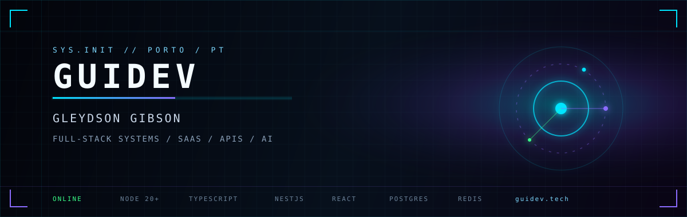

<div align="center">
  
</div>

<p align="center">
  
</p>

<p align="center">
  
  
  
  
</p>

---

```text
+-- whoami ----------------------------------------------------------+
|  alias     guiDev                                                  |
|  name      Gleydson Gibson                                         |
|  loc       Porto, Portugal                                         |
|  role      Full-Stack Engineer                                     |
|  signal    sistemas web que sobrevivem em producao                 |
|  loop      TypeScript | NestJS | React | PostgreSQL | Redis        |
+--------------------------------------------------------------------+
```

Construo produtos de ponta a ponta: contrato da API, domínio, persistência, fila, UI e operação. O foco é SaaS B2B, APIs REST e infraestrutura de agentes — código explícito, limites claros e comportamento verificável.

**O que eu construo**

- Plataformas SaaS com autenticação, RBAC e isolamento por tenant
- APIs REST com validação, filas e observabilidade
- Front-ends em React/Next.js com tipagem forte e fluxos reais
- Sistemas com IA aplicada (workers, memória de agentes, extração)

---

## Sistemas em destaque

| Sistema | Missão | Superfície |
| :--- | :--- | :--- |
| **[Prospectly](https://github.com/Gleydsong/prospectly)** | SaaS B2B para prospectar, analisar e organizar negócios locais que precisam de presença digital | React / NestJS / Prisma / PostgreSQL / Redis / BullMQ |
| **[memory-shared](https://github.com/Gleydsong/memory-shared)** | Memória compartilhada entre agentes (Orca, Codex, Grok, Cursor) com isolamento de projeto | TypeScript / MCP / Redis / Docker |
| **[extractionstack](https://github.com/Gleydsong/extractionstack)** | Análise assíncrona de URLs públicas: stack, performance, segurança e evidências | NestJS / Playwright / BullMQ / PostgreSQL |
| **[guidev.tech](https://guidev.tech)** | Portfólio e canal público | Next.js / TypeScript |

---

## Stack

<p align="center">
  
</p>

| Camada | Ferramentas |
| :--- | :--- |
| **Interface** | React, Next.js, TypeScript, Tailwind, Vite, TanStack Query |
| **Domínio / API** | Node.js, NestJS, Express, Zod, JWT, RBAC |
| **Dados** | PostgreSQL, Prisma, MySQL, Redis |
| **Runtime** | Docker, BullMQ, GitHub Actions, Playwright |
| **Adjacente** | Java, MCP, observabilidade, IA local (Ollama) |

---

## Telemetria

<p align="center">
  
  
</p>

<p align="center">
  
</p>

---

## Uplink

<p align="center">
  <a href="https://guidev.tech"></a>
  <a href="https://www.linkedin.com/in/gleydsongibson"></a>
  <a href="https://twitter.com/guiDev34"></a>
  <a href="mailto:ggleydson@icloud.com"></a>
</p>

---

<div align="center">

`protocol: production-first` / `locale: pt-PT / pt-BR` / `commit: ship systems, not demos`

<sub>Se o sistema não pode ser operado, testado e revertido, ainda não está pronto.</sub>

</div>
